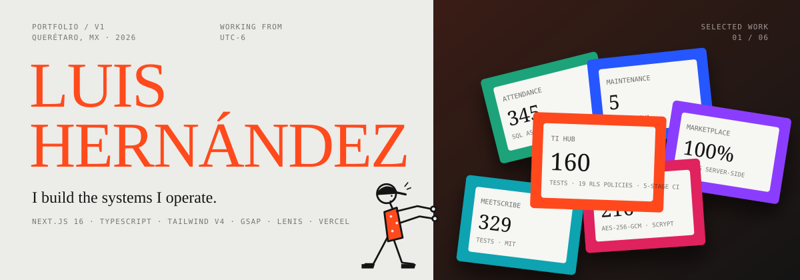
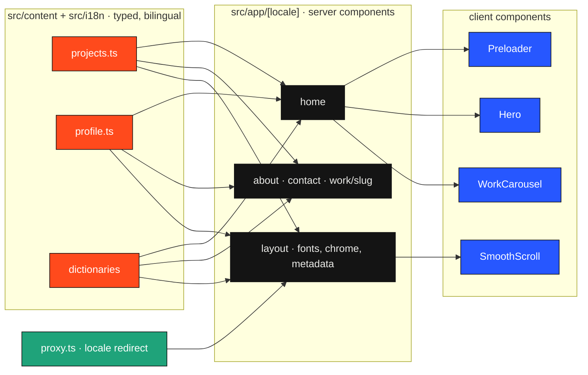

<p align="center">
  
</p>

<p align="center">
  <a href="https://github.com/LittlePitza/portfolio/actions/workflows/ci.yml"></a>
  
  
  
  
  <a href="LICENSE"></a>
</p>

<h3 align="center"><a href="https://lhernandez.dev">lhernandez.dev</a></h3>
<p align="center">Full-stack developer and IT lead in Querétaro, Mexico.<br>A site where the recognition column holds numbers, not awards.</p>

<br>

## The idea

Most portfolio sites show screenshots and let you guess. This one treats every
project like a technical sheet: role, stack, launch date and the figures that
can be checked. Tests in CI, migrations, SLA held, availability, spend cut.

The presentation borrows from the best creative portfolios: a character that
pushes a black curtain off the screen, a name set in a giant serif, a pinned
carousel driven by scroll, and a fixed frame with a local clock. Underneath it
is a static, typed, bilingual Next.js app that builds to 23 pages and ships no
runtime data layer at all.

<br>

## What is inside

<table>
  <tr>
    <td width="33%" valign="top">
      <strong style="color:#FF4A1C">Opening</strong><br>
      An illustrated character walks in, strains, and shoves the curtain to the right. Plays once per session, skipped under <code>prefers-reduced-motion</code>. A Rive file can replace the SVG.
    </td>
    <td width="33%" valign="top">
      <strong>Selected work</strong><br>
      Six projects on a scroll-pinned stage: metadata columns on the left, cover in the centre, a vertical wheel on the right and a counter. On phones it becomes a plain list.
    </td>
    <td width="33%" valign="top">
      <strong>Small details</strong><br>
      A black curtain with the destination's name between pages. Contact opens as floating cards instead of a page. Hover the head on About and the cap lifts while the things on his mind float out, each with its own story. Leave the tab and the title asks you back.
    </td>
  </tr>
  <tr>
    <td width="33%" valign="top">
      <strong>Two languages</strong><br>
      <code>/en</code> and <code>/es</code>, chosen at the edge from a cookie or the browser. Every content string is typed as <code>Localized&lt;T&gt;</code>; a missing translation fails the build.
    </td>
    <td width="33%" valign="top">
      <strong>Brutalist kit</strong><br>
      Hard 2px borders, offset shadows, mono uppercase labels, rotated stamps and an engineering grid. One accent, international orange. The monogram is pure geometry so it survives a 16px tab icon.
    </td>
    <td width="33%" valign="top">
      <strong>Generated images</strong><br>
      Favicon, Apple icon and per-language OpenGraph cards are built from the same mark with <code>next/og</code>, using the bundled Instrument Serif and Geist Mono.
    </td>
  </tr>
</table>

<br>

## Stack

| Layer | Choice | Why |
| --- | --- | --- |
| Framework | Next.js 16, App Router, React 19 | Static generation for every route, server components by default |
| Language | TypeScript, strict | The content model is typed; the compiler proofreads both languages |
| Styling | Tailwind v4 with `@theme` tokens | Three colours, three fonts, two utility classes carry the whole identity |
| Motion | GSAP 3.15, ScrollTrigger, Lenis | Pinning, snapping and smooth scroll that agree with each other |
| Type | Instrument Serif, Geist, Geist Mono | Serif for scale, sans for reading, mono for labels and numbers |
| Hosting | Vercel | Preview per branch, zero config for the App Router |

<br>

## Architecture



Server components resolve content for one locale and pass plain strings down.
Client components own motion and nothing else. The full walkthrough, including
the request path and the reasons behind each omission, is in
[docs/architecture.md](docs/architecture.md).

```
src/
├── app/[locale]/        routes: home, about, contact, work/[slug], not-found
├── components/
│   ├── chrome/          Frame, NavLinks, PageTransition, ContactOverlay, TabTitle, Clock, LocaleSwitch, Footer
│   ├── preloader/       Preloader, Character, PreloaderContext
│   ├── hero/            Hero
│   ├── work/            WorkCarousel, Cover, types
│   ├── about/           InsideHead
│   └── ui/              Mark, Icons, Cursor, Reveal, CountUp, Marquee, PageHeader, CopyEmail
├── content/             site.ts, projects.ts, profile.ts, head.ts
├── assets/fonts/        TTFs used only for generated images
├── i18n/                config, dictionaries/en, dictionaries/es
├── lib/gsap.ts          plugin registration, reduced-motion helper
├── lib/scroll.ts        one Lenis instance shared by carousel, nav and transitions
└── proxy.ts             edge redirect to /en or /es
```

<br>

## Running it

Requires Node 24 (see `.nvmrc`).

```bash
npm install
npm run dev
```

| Script | What it does |
| --- | --- |
| `npm run dev` | Development server with Turbopack |
| `npm run check` | ESLint plus a typecheck that regenerates route types first |
| `npm run build` | Production build, 23 static pages |
| `npm start` | Serve the production build |

<br>

## Editing content

- **A project** is one object in `src/content/projects.ts`. Add it to the
  array and it appears in the carousel, gets its own route under `/work/`,
  and lands in the sitemap. Drop a screenshot in `public/covers/` and point
  `cover` at it; until then a generated cover is drawn from the project's
  colour and numbers.
- **Facts, capabilities, process and experience** live in
  `src/content/profile.ts`.
- **UI strings** live in `src/i18n/dictionaries/`. The Spanish file is typed
  against the English one.
- **Identity** (name, email, links, résumé paths, optional Rive character)
  lives in `src/content/site.ts`.

<br>

## Design notes

The palette is deliberately small: a warm grey page, near-black ink and one
accent, international orange. Project colours only ever appear inside covers
and swatches. The fixed chrome is painted white under
`mix-blend-mode: difference`, which is why it stays legible over both the grey
page and the black section headers without a second variant.

The reference for the experience is [huyml.co](https://huyml.co). The
analysis of what makes it work, and what this site does differently, is kept in
[docs/00-analisis-referencia-huyml.md](docs/00-analisis-referencia-huyml.md).

<br>

## Roadmap

- Final illustration for the character, optionally animated in Rive
- Real, anonymised screenshots of the internal systems
- A playground section for open-source work and experiments

<br>

<p align="center">
  <sub>Code under MIT. Content, résumés and illustrations are personal material. Built by <a href="https://github.com/LittlePitza">Luis Hernández</a>.</sub>
</p>
