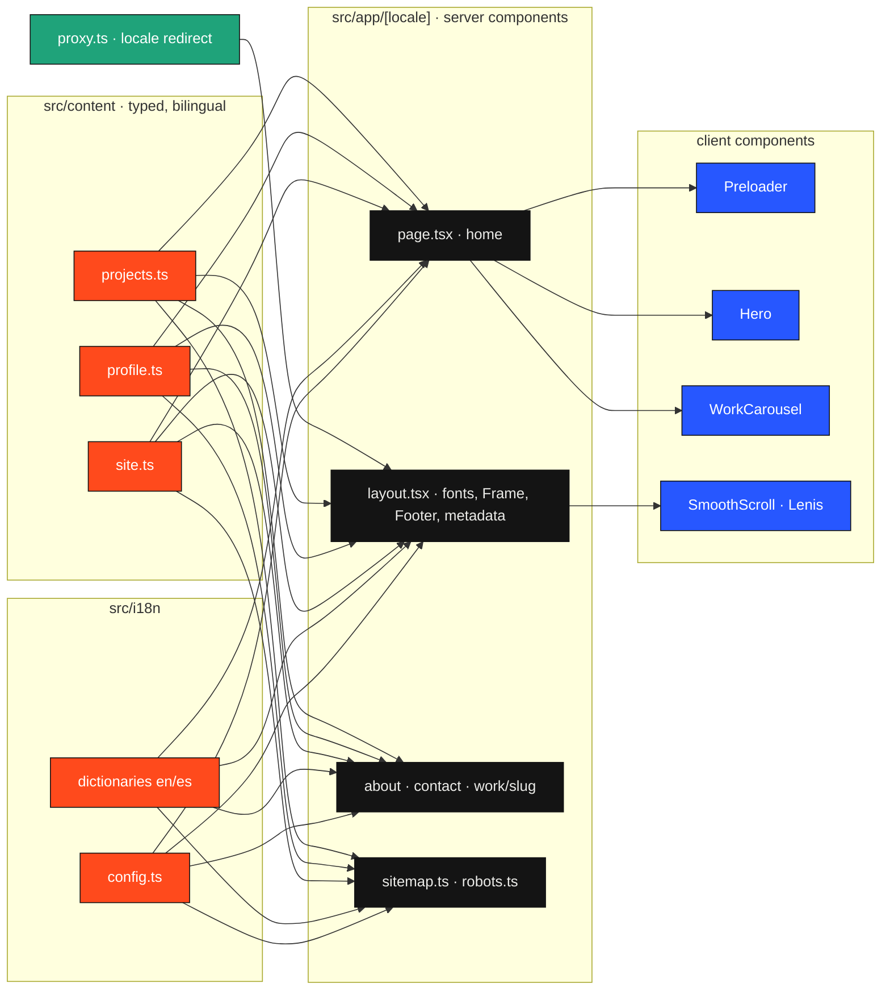

# Architecture

How the site is put together, and why. The short version: static content, typed
end to end, rendered ahead of time, with motion layered on top and never in the
way of the content.

## Layers

## Request path

1. `src/proxy.ts` runs at the edge. A request without a locale prefix is
   redirected to `/en` or `/es`, chosen from the `locale` cookie or the
   `Accept-Language` header. Static files and internals are skipped.
2. `src/app/[locale]/layout.tsx` is the root layout. It validates the locale,
   loads the three fonts, builds per-language metadata, and wraps the page in
   the fixed chrome and the smooth-scroll provider.
3. Every page is a server component. It resolves the content for its locale
   and hands plain strings to client components, so nothing bilingual ships to
   the browser twice.
4. `generateStaticParams` on the layout and on `work/[slug]` produce all 23
   routes at build time. There is no runtime data source.

## Content model

Content lives in TypeScript, not in a CMS, because it changes a few times a
year and benefits from type-checking more than from an editor UI.

- `Localized<T>` is `Record<"en" | "es", T>`. Every user-facing string in the
  content files is one of these, so a missing translation is a compile error.
- `Project` carries what the carousel columns need: role, stack, launch,
  status and `numbers`, the verifiable figures that stand in for awards.
- `cover` is optional. Without it `Cover.tsx` draws a generated app window in
  the project colour using those same numbers, so the layout looks finished
  before screenshots exist.
- The dictionaries in `src/i18n` hold UI strings only. `es.ts` is typed as
  `typeof en`, which keeps both files in lockstep.

## Motion

Animation is a client concern and is isolated to four components.

- `SmoothScroll` creates one Lenis instance, feeds it from GSAP's ticker and
  calls `ScrollTrigger.update` on scroll, so pinning and smoothing agree.
- `Preloader` runs a GSAP timeline once per session: the character walks in,
  strains, and pushes the black curtain off-screen. It flips a context flag
  that `Hero` waits for before revealing the name.
- `WorkCarousel` pins a full-viewport stage and maps scroll progress to an
  index with snapping. A second effect animates covers, metadata and the
  vertical wheel whenever that index changes. Below `lg` and under
  `prefers-reduced-motion` the same slides render as a plain list; the stage
  is never mounted.
- All GSAP work goes through `useGSAP` with a scope, so selectors stay local
  and tweens are reverted on unmount.

## Chrome

`Frame` is fixed, pointer-events-none, and painted with
`mix-blend-mode: difference` in white. On the light page it reads near-black;
over the black headers it reads white. That is what lets one component sit on
top of every route without per-page variants.

## Design tokens

Defined once in `globals.css` and exposed to Tailwind through `@theme inline`:
background `#ECECE9`, ink `#141414`, accent `#FF4A1C`, and three font stacks
(Instrument Serif for display, Geist for text, Geist Mono for labels). The two
utility classes that carry the identity are `.display` and `.label`.

## Quality gates

`npm run check` runs ESLint and a typecheck that regenerates Next's route
types first. CI runs lint, typecheck and a production build on every push and
pull request.

## Deliberate omissions

- No database or Supabase in v1. Nothing here needs a runtime store.
- No i18n library. Two locales and a handful of routes do not justify one.
- No MDX. Case-study bodies are arrays of paragraphs; MDX can replace them if
  they ever need rich formatting.
